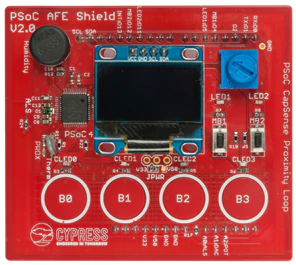

# CY8CKIT-032 shield support library

The CY8CKIT-032 is an Arduino Uno R3 compatible shield intended as a companion to add an analog front end (AFE) and user interface to a baseboard. Any baseboard with Arduino Uno R3 compatible headers and I2C master functionality on the Arduino Uno R3 I2C pins is compatible with this shield.

A PSoC 4 Analog Coprocessor is used on the shield to read analog sensors (temperature, humidity, ambient light and potentiometer voltage) and to provide a CapSense user interface. The PSoC 4 acts as an I2C slave so that the analog sensor values can be read by the baseboard.

The shield library provides support for:
* Initializing/freeing all of the hardware peripheral resources on the board
* Defining all pin mappings from the Arduino interface to the different peripherals
* Providing access to each of the underlying peripherals on the board

This library makes use of the [display-oled-ssd1306](https://github.com/cypresssemiconductorco/display-oled-ssd1306) library. This can be seen in the libs directory and can be used directly instead of through the shield if desired.

It comes with the sensors and user interface items below.



## Analog Sensors
The PSoC AFE Shield implements the functionality of an analog coprocessor by measuring the analog sensors and transferring the digitized data to the base board via I2C. It interfaces with the following sensors:

* Temperature (resistance)
* Humidity (capacitance)
* Ambient Light (current)
* Potentiometer (voltage)

## User Interface
The PSoC AFE Shield provides the following user interface for the base board:

* 4x CapSense buttons (I2C) + 4 LEDs
* 1x CapSense proximity sensor (I2C) + 1 LED
* 128x64 graphics OLED display (I2C)
* 2x Mechanical buttons (GPIO) + 2 LEDs

# Quick Start Guide

* [AFE application](#afe-application)
* [AFE pinout examples](#afe-pinout-examples)
* [Display usage](https://github.com/cypresssemiconductorco/display-oled-ssd1306#quick-start)

## AFE application
Follow the steps below in order to create a simple application showing how to read sensors and manipulate LEDs on the shield.
1. Create an empty PSoC application
2. Add this library and the retarget-io library to the application
4. Place the following code in the main.c file:
```cpp
#include "cyhal_system.h"
#include "cybsp.h"
#include "cy8ckit_032.h"
#include "cy_retarget_io.h"

int main(void)
{
    cy_rslt_t result;
    uint8_t led_states;
    uint8_t button_states;
    float light, humidity, voltage, temperature;


    /* Initialize the device, board peripherals, and retarget-io lib */
    result = cybsp_init();
    CY_ASSERT(result == CY_RSLT_SUCCESS);
    result = cy8ckit_032_init(NULL);
    CY_ASSERT(result == CY_RSLT_SUCCESS);
    result = cy_retarget_io_init(CYBSP_DEBUG_UART_TX, CYBSP_DEBUG_UART_RX, CY_RETARGET_IO_BAUDRATE);
    CY_ASSERT(result == CY_RSLT_SUCCESS);

    __enable_irq();

    /* Gets the current state of the leds. Since, at this point, the led
     * control mode is capsense mode the led state will match which buttons are
     * currently being pressed */
    cy8ckit_032_get_cled_states(&led_states);

    /* Enables software control of the board leds and turns 2 CLEDs on */
    cy8ckit_032_set_led_control(CY8CKIT_032_LED_CTRL_SW);
    cy8ckit_032_set_cled_states(CY8CKIT_032_CLED1 | CY8CKIT_032_CLED3);

    for(;;)
    {
        cy8ckit_032_get_button_states(&button_states);
        printf("CB0 is %s\r\n", CY8CKIT_032_BTN_CAPSENSE_B0 & button_states ? "pressed" : "not pressed");
        printf("CB1 is %s\r\n", CY8CKIT_032_BTN_CAPSENSE_B1 & button_states ? "pressed" : "not pressed");
        printf("CB2 is %s\r\n", CY8CKIT_032_BTN_CAPSENSE_B2 & button_states ? "pressed" : "not pressed");
        printf("CB3 is %s\r\n", CY8CKIT_032_BTN_CAPSENSE_B3 & button_states ? "pressed" : "not pressed");
        printf("MB0 is %s\r\n", CY8CKIT_032_BTN_MECHANICAL_B1 & button_states ? "pressed" : "not pressed");
        printf("MB1 is %s\r\n", CY8CKIT_032_BTN_MECHANICAL_B2 & button_states ? "pressed" : "not pressed");
        printf("PRX is %s\r\n", CY8CKIT_032_BTN_PROXIMITY & button_states ? "pressed" : "not pressed");

        cy8ckit_032_get_ambient_light_lux(&light);
        printf("Light level: %2.2flux\r\n", light);
        cy8ckit_032_get_humidity_percent(&humidity);
        printf("Humidity: %2.2f%%\r\n", humidity);
        cy8ckit_032_get_potentiometer_voltage(&voltage);
        printf("Potentiometer voltage: %2.2fV\r\n", voltage);
        cy8ckit_032_get_temperature_c(&temperature);
        printf("Temperature: %fC\r\n\r\n", temperature);

        cyhal_system_delay_ms(1000);
    }
}
```
4. Build the application and program the kit.

## AFE pinout examples
The following snippits of code show how to interact with other features of the shield that are exposed to the base board through the Arduino pins.

```cpp
    //ADC sample code
    cyhal_adc_t adc;
    cyhal_adc_channel_t adcChanLight, adcChanPot, adcChanDac;
    result = cyhal_adc_init(&adc, CY8CKIT_032_PIN_DAC_VOLTAGE, NULL);
    result = cyhal_adc_channel_init(&adcChanLight, &adc, CY8CKIT_032_PIN_LIGHT_SENSOR);
    result = cyhal_adc_channel_init(&adcChanPot, &adc, CY8CKIT_032_PIN_POTENTIOMETER);
    result = cyhal_adc_channel_init(&adcChanDac, &adc, CY8CKIT_032_PIN_DAC_VOLTAGE);
    uint16_t adcValLight = cyhal_adc_read_u16(&adcChanLight);
    uint16_t adcValPot = cyhal_adc_read_u16(&adcChanPot);
    uint16_t adcValDac = cyhal_adc_read_u16(&adcChanDac);
```

```cpp
    //LED/Button sample code
    result = cyhal_gpio_init(CY8CKIT_032_PIN_BUTTON1, CYHAL_GPIO_DIR_INPUT, CYHAL_GPIO_DRIVE_NONE, false);
    result = cyhal_gpio_init(CY8CKIT_032_PIN_BUTTON2, CYHAL_GPIO_DIR_INPUT, CYHAL_GPIO_DRIVE_NONE, false);

    result = cyhal_gpio_init(CY8CKIT_032_PIN_LED1, CYHAL_GPIO_DIR_OUTPUT, CYHAL_GPIO_DRIVE_STRONG, true);
    result = cyhal_gpio_init(CY8CKIT_032_PIN_LED2, CYHAL_GPIO_DIR_OUTPUT, CYHAL_GPIO_DRIVE_STRONG, true);

    bool btn1 = cyhal_gpio_read(CY8CKIT_032_PIN_BUTTON1);
    bool btn2 = cyhal_gpio_read(CY8CKIT_032_PIN_BUTTON2);
    cyhal_gpio_write(CY8CKIT_032_PIN_LED1, !btn1);
    cyhal_gpio_write(CY8CKIT_032_PIN_LED2, !btn2);
```

```cpp
    // CapSense ISR sample code
    void capsense_isr_callback(void *callback_arg, cyhal_gpio_event_t event)
    {
    	CY_UNUSED_PARAMETER(callback_arg);
    	CY_UNUSED_PARAMETER(event); //Will always be CYHAL_GPIO_IRQ_RISE
    	//Do something on interrupt trigger
    }

    result = cyhal_gpio_init(CY8CKIT_032_PIN_CAPSENSE_ISR, CYHAL_GPIO_DIR_INPUT, CYHAL_GPIO_DRIVE_NONE, false);
    cyhal_gpio_register_callback(CY8CKIT_032_PIN_CAPSENSE_ISR, capsense_isr_callback, NULL);
    cyhal_gpio_enable_event(CY8CKIT_032_PIN_CAPSENSE_ISR, CYHAL_GPIO_IRQ_RISE, CYHAL_ISR_PRIORITY_DEFAULT, true);
```

```cpp
    // GPIO sample code
    result = cyhal_gpio_init(CY8CKIT_032_PIN_GPIO, CYHAL_GPIO_DIR_BIDIRECTIONAL, CYHAL_GPIO_DRIVE_PULLUPDOWN, true);
    bool gpio = cyhal_gpio_read(CY8CKIT_032_PIN_BUTTON1);
    cyhal_gpio_write(CY8CKIT_032_PIN_GPIO, !gpio);
```

```cpp
    // UART sample code
    cyhal_uart_t uart;
    static const cyhal_uart_cfg_t UART_CFG = {
		.data_bits = 8,
		.stop_bits = 1,
		.parity = CYHAL_UART_PARITY_NONE,
		.rx_buffer = NULL,
		.rx_buffer_size = 0,
    };
    const uint32_t UART_DESIRED_BUAD = 115200;
    uint8_t uartValue;
    uint32_t uartActualBaud;
    result = cyhal_uart_init(&uart, CY8CKIT_032_PIN_UART_TX, CY8CKIT_032_PIN_UART_RX, NULL, &UART_CFG);
    result = cyhal_uart_set_baud(&uart, UART_DESIRED_BUAD, &uartActualBaud);
    result = cyhal_uart_getc(&uart, &uartValue, 0);
    result = cyhal_uart_putc(&uart, uartValue);
```

### More information

* [API Reference Guide](https://cypresssemiconductorco.github.io/cy8ckit-032/html/index.html)
* [CY8CKIT-032 Documentation](https://www.cypress.com/documentation/development-kitsboards/cy8ckit-032-psoc-analog-front-end-afe-arduino-shield)
* [SEGGER emWin Middleware Library](https://github.com/cypresssemiconductorco/emwin)
* [Cypress Semiconductor, an Infineon Technologies Company](http://www.cypress.com)
* [Cypress Semiconductor GitHub](https://github.com/cypresssemiconductorco)
* [ModusToolbox](https://www.cypress.com/products/modustoolbox-software-environment)

---
© Cypress Semiconductor Corporation, 2019-2021.
